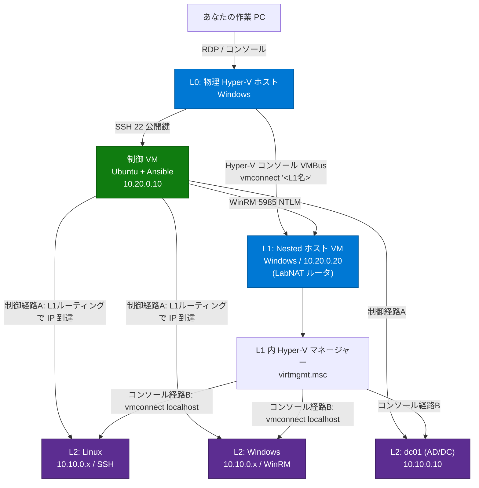

# 接続ガイド — 構築後の VM へどうアクセスするか

`bootstrap.ps1` で環境が建ったあと、**どの端末（L0 / 制御VM / L1 / L2）に・どこから・どの
プロトコルで・どの資格情報で入るか**をまとめる。Nested 構成のため経路が層をまたいで複雑に
なるので、まずは全体像と「2 つの経路」を押さえてほしい。

> 接続先・資格情報は `bootstrap.ps1` の最後に **`Write-ConnectionInfo`** が実環境の値で
> 一覧表示する（下記「構築完了後に表示される接続サマリ」参照）。本書はその背景にある
> 設計と、各パターンの使い分けを説明する読み物。

---

## いちばん大事な前提 — 「制御の経路」と「コンソールの経路」は別物

この環境には性質の異なる 2 つの到達経路がある。混同するとハマる。

| 経路 | 何のため | 通り道 | 中身 |
|---|---|---|---|
| **A. 制御（自動化）経路** | スクリプト/Ansible で中を作り込む | IP ネットワーク（CtrlNAT → L1 ルーティング → LabNAT） | SSH / WinRM |
| **B. コンソール（画面）経路** | GUI で画面を見て触る・OS が無反応でも触る | Hyper-V マネージャーの**入れ子**（L0→L1→L2） | VMBus（ネットワーク非依存） |

- **L2 VM は LabNAT(10.10.0.0/24) に隔離**されている。あなたの作業 PC や L0 から L2 の IP へは
  **直接届かない**。制御したいなら「制御VM を踏み台」、画面を見たいなら「L1 の Hyper-V
  マネージャー」を必ず経由する。
- **PowerShell Direct / Hyper-V コンソールは VMBus 経由**なので、IP も WinRM も無い作りたての
  VM や、ネットワークが壊れた VM にも届く。最後の砦。

---

## 全体像（接続トポロジ図）

```text
                          ┌──────────────────────────────────────────────────────┐
   あなたの作業 PC ───────▶│ L0: 物理 Hyper-V ホスト (Windows)                     │
   RDP / コンソール        │   ・Hyper-V マネージャー / vmconnect で各 VM 画面へ   │
                          │   ・PowerShell + PowerShell Direct で土台を構築       │
                          └───┬───────────────────────────┬──────────────────────┘
                              │ SSH(22)                    │ Hyper-V コンソール (VMBus)
                              │ 公開鍵                     │  vmconnect localhost "<L1名>"
                              ▼                            ▼
        CtrlNAT 10.20.0.0/24  │                  ┌───────────────────────────────┐
        ┌─────────────────────┴────────┐         │ L1: Nested Hyper-V ホスト VM  │
        │ 制御 VM (Ubuntu + Ansible)    │         │  10.20.0.20  (Windows)        │
        │  10.20.0.10                   │         │  ・ここが LabNAT のルータ     │
        │  ・自動化の頭脳               │  WinRM  │  ・L1 内に Hyper-V マネージャー│
        │  ・ここから L1/L2 を Ansible  │────────▶│    (virtmgmt.msc) で L2 を操作│
        └───────────────┬───────────────┘ 5985    └───────────────┬───────────────┘
                        │ 制御経路 (A)                            │ コンソール経路 (B)
                        │ 「L1 ルーティング」で L2 の IP へ        │ L1 の中で vmconnect
                        ▼                                         ▼
            LabNAT 10.10.0.0/24 (GW=L1 10.10.0.1)   ┌──────────────────────────────┐
            ┌───────────────┬───────────────┐       │ L1 内の Hyper-V マネージャー │
            ▼               ▼               ▼       │  Get-VM / vmconnect localhost│
    ┌─────────────┐ ┌─────────────┐ ┌─────────────┐ └──────────────────────────────┘
    │ L2: Linux   │ │ L2: Windows │ │ L2: dc01    │
    │ SSH(22)     │ │ WinRM(5985) │ │ AD/DC       │
    │ labadmin    │ │ Administr.. │ │ NETBIOS\Adm.│
    └─────────────┘ └─────────────┘ └─────────────┘
       ▲                  ▲
       └── 制御 VM からのみ IP 到達（作業 PC/L0 からは直接不可）──┘
```

### Mermaid 版（GitHub 上で図として描画される）



---

## 接続マトリクス（早見表）

| 接続先 | 接続元 | プロトコル | 既定アドレス | ユーザー | 認証 | 用途 |
|---|---|---|---|---|---|---|
| **L0 物理ホスト** | 制御 VM | WinRM/HTTP | `10.20.0.1:5985` | `host-cred.json` の `user` | NTLM | Ansible が L0 で L1/NAT/golden を操作 |
| **制御 VM** | L0 物理ホスト | SSH | `10.20.0.10:22` | `labadmin` | 公開鍵（`build/ssh/id_ed25519`） | 自動化の操作卓に入る |
| **L1 ホスト** | L0 物理 / 制御 VM | WinRM/HTTP | `10.20.0.20:5985` | `Administrator` | NTLM | L1 内の Hyper-V/L2 を構成 |
| **L1 ホスト（画面）** | L0 物理ホスト | Hyper-V コンソール | （VMBus） | `Administrator` | パスワード | GUI 操作・L2 を覗く土台 |
| **L1 ホスト（画面・RDP）** | L0 物理ホスト | RDP | `10.20.0.20:3389` | `Administrator` | NLA/パスワード | GUI を快適に（CtrlNAT 経由で直接） |
| **L2 Linux** | 制御 VM | SSH | `10.10.0.x:22` | `labadmin` | 公開鍵（制御 VM の鍵） | Linux ゲストを操作 |
| **L2 Windows（非ドメイン）** | 制御 VM | WinRM/HTTP | `10.10.0.x:5985` | `Administrator` | NTLM | Windows ゲストを操作 |
| **L2 Windows（ドメイン参加）** | 制御 VM | WinRM/HTTP | `10.10.0.x:5985` | `NETBIOS\Administrator` | CredSSP または NTLM | DC/クラスタ等の特権操作 |
| **L2 Windows（画面・RDP）** | **L1 の中から** | RDP | `10.10.0.x:3389` | `Administrator` | NLA/パスワード | GUI を快適に（LabNAT は L1 経由） |
| **L2（画面）** | L1 内 Hyper-V マネージャー | コンソール | （VMBus） | ゲストの資格情報 | パスワード | IP が無い/壊れた L2 を触る |

> 既定パスワードは golden の `Administrator` / `P@ssw0rd-Lab-Change!`（`secrets.yml` で上書き推奨）。
> SSH の `labadmin` は cloud-init が `build/ssh/id_ed25519` の公開鍵を入れるためパスワード不要。
> **RDP は検証環境向けに既定で有効化済み**（`Initialize-L1Network.ps1` / `Initialize-L2Access.ps1` が
> IP/WinRM と同じ段で `fDenyTSConnections=0` + ファイアウォール許可 + NLA を冪等に焼く）。
> L1 へは L0 から直接 `mstsc`、L2 へは LabNAT 隔離のため **L1 の中から** `mstsc`（→ パターン 3）。

---

## アクセスパターン別の使い方

### パターン 1: SSH で入る（Linux 系）

**対象**: 制御 VM、L2 Linux。

```powershell
# (a) L0 から制御 VM に入る ── まずはここが自動化の操作卓
ssh -i "build\ssh\id_ed25519" labadmin@10.20.0.10
```

```bash
# (b) 制御 VM から L2 Linux に入る ── L2 は制御 VM からしか IP 到達できない
#     (制御 VM の中で実行。鍵は Invoke-Ansible が ~/.ssh/id_ed25519 に配置済み)
ssh labadmin@10.10.0.50
```

- L2 Linux は **cloud-init** が hostname / 静的 IP / SSH 公開鍵を設定済み。
- あなたの作業 PC や L0 から `10.10.0.50` へ直接 `ssh` しても**届かない**。必ず制御 VM 経由。
  （どうしても 1 コマンドで入りたいなら制御 VM を踏み台にした多段 SSH:
  `ssh -J labadmin@10.20.0.10 labadmin@10.10.0.50`）

### パターン 2: PowerShell で入る（Windows 系）

**対象**: L0、L1、L2 Windows。WinRM(5985) または PowerShell Direct。

```powershell
# (a) L1 ホストへ WinRM (L0 物理ホスト or 制御 VM から)
Enter-PSSession -ComputerName 10.20.0.20 -Authentication Negotiate `
  -Credential (Get-Credential 'Administrator')

# (b) L2 Windows へ WinRM (制御 VM から / L1 ルーティング経由)
Enter-PSSession -ComputerName 10.10.0.51 -Authentication Negotiate `
  -Credential (Get-Credential 'Administrator')
# ドメイン参加済みなら 'LAB\Administrator' を使う

# (c) PowerShell Direct ── IP も WinRM も無い VM に VMBus で入る最後の砦
#     L0 から L1 へ:
Enter-PSSession -VMName "<L1名>" -Credential (Get-Credential 'Administrator')
#     L1 の中で L2 へ（二段 PowerShell Direct）:
Enter-PSSession -VMName "<L2名>" -Credential (Get-Credential 'Administrator')
```

- **WinRM** は「IP が付いて WinRM が有効化された後」の通常運用。Ansible もこれを使う。
- **PowerShell Direct** はネットワークに依存しない（VMBus）。`Initialize-L1Network.ps1` /
  `Initialize-L2Access.ps1` がまさにこれで作りたての VM に初期 IP/WinRM を焼いている。
  運用でも「ネットワーク設定をミスって WinRM が死んだ」時の復旧経路になる。
- ドメイン参加済み Windows L2 で DC への二段ホップ（クラスタ作成等）が要る操作は **CredSSP**。
  詳細は [`KB/0006`](../KB/0006-nested-s2d-cluster.md)。

### パターン 3: Hyper-V マネージャーでつなぐ（GUI / コンソール）

**対象**: L1 の画面（L0 から）、L2 の画面（L1 の中から）。

GUI で画面を見たい、サインイン画面から触りたい、ネットワークが無くても操作したい時はこれ。

```text
1. L0 の Hyper-V マネージャーで L1 のコンソールを開く
     GUI      : Hyper-V マネージャー > <L1名> > 接続
     コマンド : vmconnect.exe localhost "<L1名>"
2. L1 に Administrator でサインイン
3. L1 の中で Hyper-V マネージャー (virtmgmt.msc) を開く
     VM 一覧  : Get-VM
     L2 の画面: vmconnect.exe localhost "<L2名>"
```

- **L2 の電源 ON/OFF・設定変更・コンソール表示は、すべて L1 の中の Hyper-V マネージャー**で
  行う（L0 の Hyper-V マネージャーには L2 は出てこない。L2 は L1 が持っている VM だから）。
- 「L1 の中に入って、さらにその中の Hyper-V を操作する」という**入れ子**になる点が肝。

#### RDP チェーンで GUI を快適に（vmconnect の代替）

`vmconnect`（VMBus コンソール）は OS が無反応でも映る最後の砦だが、解像度・クリップボード
共有・マルチモニタは RDP の方が快適。本リポジトリは **L1/L2 Windows の RDP を既定で有効化**
しているので、`mstsc` をチェーンすれば GUI でつなげる。

```text
1. L0 から L1 へ RDP（CtrlNAT 経由で直接届く）
     mstsc /v:10.20.0.20            # Administrator / P@ssw0rd-Lab-Change!
2. その L1 セッションの中から、さらに L2 へ RDP（LabNAT は L1 経由でしか届かない）
     mstsc /v:10.10.0.51            # 対象 L2 Windows の IP
```

- **L2 への RDP は必ず「L1 の中から」**。作業 PC / L0 から `10.10.0.x:3389` へ直接は届かない
  （LabNAT 隔離。SSH/WinRM と同じく L1 が踏み台）。
- RDP が前提とするのは IP が付き OS が起動していること。**作りたて・ネットワークが壊れた VM**は
  RDP では入れないので、その場合は vmconnect か PowerShell Direct（パターン 2(c)）を使う。
- 既定で有効化される実体: `fDenyTSConnections=0` + ファイアウォール `Remote Desktop` グループ許可 +
  `UserAuthentication=1`（NLA 維持）。既存 VM は `bootstrap.ps1` 再実行で冪等に収束する。

### パターン 4: 直接はつながらない VM をどう触るか

**対象**: L2 全般（作業 PC / L0 から見たとき）。

L2 は LabNAT に隔離されているので、作業 PC や L0 からは **IP でも GUI でも直接届かない**。
触り方は次の 3 つに集約される。

| やりたいこと | 経路 | 具体 |
|---|---|---|
| コマンドで自動化・操作 | **制御 VM を踏み台** | 制御 VM に SSH → そこから L2 へ SSH/WinRM |
| 画面を見て GUI 操作（堅牢） | **L1 の Hyper-V マネージャー** | L0→L1 コンソール→ L1 内で `vmconnect localhost "<L2名>"` |
| 画面を見て GUI 操作（快適） | **L1 を踏み台に RDP チェーン** | L0→L1 へ `mstsc`→ L1 内から L2 へ `mstsc`（RDP は既定で有効化済み） |
| ネットワークごと壊れた L2 を復旧 | **二段 PowerShell Direct** | L0→L1 PS Direct → さらに L2 へ PS Direct |

> 「直接つなぎたい」誘惑に駆られるが、**LabNAT を隔離したまま踏み台で入る**のがこの設計の
> 意図（L2 を本物のオフライン検証環境として閉じ込める）。直結したい特殊用途がある場合のみ、
> L1 のルーティング/ファイアウォールを明示的に開ける。

---

## 構築完了後に表示される接続サマリ（`Write-ConnectionInfo`）

`bootstrap.ps1` は最後に、その実行で建った環境の**実際の値**で接続情報を一覧表示する。
本書のマトリクスを「今回の名前・IP・パスワード」で具体化したもの。

```text
=============== 接続情報・認証情報 ===============
  !!  以下には平文パスワードを表示します。画面共有・ログ保存時は取り扱いに注意してください。

[L0: 物理 Hyper-V ホスト]
  接続先     : <host>:5985   実行元: 制御 VM   プロトコル: WinRM/HTTP/NTLM
  ユーザー   : <user>        パスワード: <...>
  接続例     : Enter-PSSession -ComputerName <host> -Authentication Negotiate ...

[制御 VM]
  接続先     : 10.20.0.10:22  プロトコル: SSH 公開鍵   ユーザー: labadmin
  接続例     : ssh -i "build/ssh/id_ed25519" labadmin@10.20.0.10

[L1: <L1名>]            ... 10.20.0.20:5985 / Administrator
[Hyper-V マネージャーで L2 VM を操作]  ... L0→L1 コンソール→ L1 内 vmconnect の手順
[L2: <名前>]            ... Linux=SSH / Windows=WinRM、ドメイン参加で出し分け
[Active Directory]     ... ドメイン管理者 / DSRM パスワード（ドメインがある場合）
====================================================
```

- **平文パスワードを表示する**ため、配信・録画・ログ共有時は伏せること（冒頭に警告を出す）。
- L2 は **OS 種別（Linux=SSH / Windows=WinRM）とドメイン参加有無**で接続方法を自動で出し分ける。
- 値は `build/host-cred.json`（L0 資格情報）、`build/ssh/id_ed25519`（SSH 鍵）、
  `build/resolved.json`（確定モデル: 名前/IP/ドメイン）から組み立てる。

---

## つながらない時（トラブルシュート → KB）

| 症状 | まず疑う | 参照 |
|---|---|---|
| 制御 VM → L1 が `No route to host` | L1 が CtrlNAT 未接続/静的IP未設定（`Initialize-L1Network.ps1`） | [`KB/0003`](../KB/0003-nested-l2-reachability-router.md) |
| 制御 VM → L2 がタイムアウト（L1 からは届く） | LabNAT が NAT のまま（ルータ化してない）/ 制御 VM の静的ルート欠落 | [`KB/0003`](../KB/0003-nested-l2-reachability-router.md) |
| L1 が再起動後に上り IF を取り違える | 動的 MAC 確定待ち / uplink pick-by-MAC | [`KB/0012`](../KB/0012-l1-uplink-pick-by-mac.md) |
| ドメイン Windows L2 でクラスタ操作が「アクセス拒否」 | NTLM では委譲不可 → CredSSP 必須 | [`KB/0006`](../KB/0006-nested-s2d-cluster.md) |
| 制御 VM が無反応/SSH が固まる | アイドルでメモリバルーンが縮んでハング | [`KB/0011`](../KB/0011-control-vm-memory-ssh-hang.md) |
| Windows L2 の WinRM が死んでいて入れない | PowerShell Direct（VMBus）で復旧 | 本書パターン 2(c) |

---

## まとめ（迷ったらこの 3 行）

- **自動化・コマンド操作** → 制御 VM に入って、そこから L2 へ（SSH=Linux / WinRM=Windows）。
- **画面を見たい・GUI** → L0 の Hyper-V マネージャーで L1 を開き、L1 の中の Hyper-V で L2 を開く。
- **ネットワークごと壊れた / 作りたて** → PowerShell Direct（VMBus）で L0→L1→L2 と入る。
